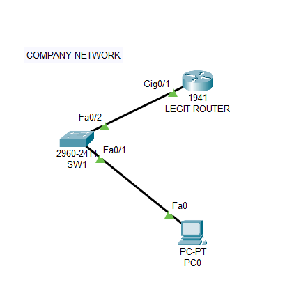
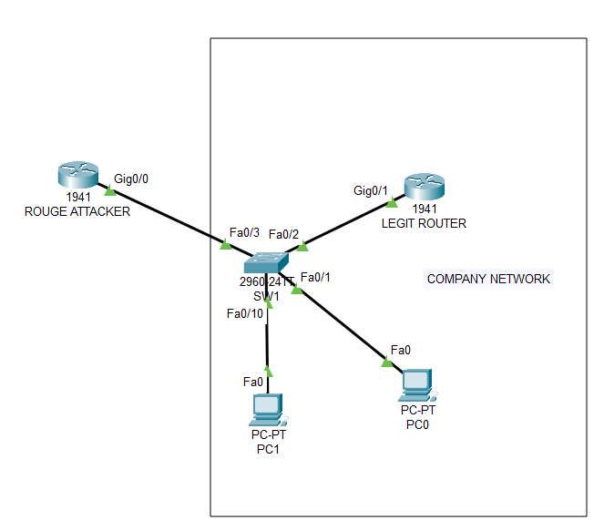
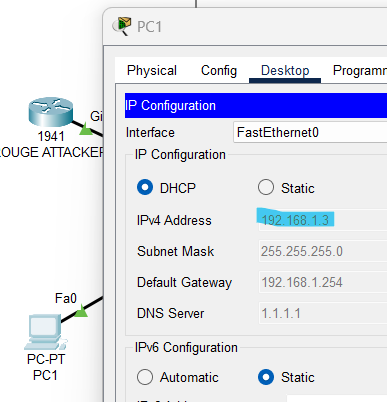

## Introduction
Spoofing attacks are a common form of cybercrime where attackers manipulate communication channels by pretending to be someone they are not. The goal is to deceive victims and gain unauthorized access to systems or sensitive information. Let’s explore one specific type of spoofing attack: DHCP Spoofing, and learn how to protect yourself from them.

### DHCP Spoofing Attacks
In a typical scenario, an attacker masquerades as a DHCP server within a local area network (LAN). DHCP clients broadcast their requests, allowing any device on the LAN to respond. The client accepts settings from the first server that replies, which means an attacker can send incorrect information (such as DNS and gateway settings) to redirect traffic to fake websites or other malicious destinations.

To counter this threat, network administrators can implement DHCP snooping, a protective measure that detects and prevents rogue DHCP servers. By understanding DHCP spoofing, we can better defend against these deceptive attacks.

## The Demonstration
In this scenario we have a company using Cisco gear for their networking needs with one legitimate router (R1-LEGIT), a switch (SW1) and a employee computer PC0.



| Device | Port       | IP |
| -----: | ---------: | -: |
| SW1    | F0/1, F0/2 | /  |
| R1-LEGIT	    | 	G0/1 | 10.10.10.254/24 |
| PC0    | Fa0/0 | DHCP |

```bash title="Router terminal"
LEGITIMNI(config)#ip dhcp pool COMPANY
LEGITIMNI(dhcp-config)#network 10.10.10.0 255.255.255.0
LEGITIMNI(dhcp-config)#default-router 10.10.10.254
LEGITIMNI(dhcp-config)#dns-server 8.8.8.8
LEGITIMNI(dhcp-config)#exit
LEGITIMNI(config)#int gig0/1
LEGITIMNI(config-if)#no shutdown
LEGITIMNI(config-if)#ip address 10.10.10.254 255.255.255.0
```

After the standard minimal router configuration a legitimate computer must receive IP settings from a legitimate DHCP server. In this case 10.10.10.1/24

Now, we have an unprotected network. Anyone can connect to the switch and say, ‘I am the DHCP server.’

### Example Attack - DHCP Spoofing
The goal of spoofing attacks is to disrupt network stability, interrupt services, or obtain sensitive information about devices and network traffic. In the context of DHCP Spoofing, a computer masquerades as a DHCP server within a LAN.

**Consider the following scenario:**
An attacker introduces a rogue router (referred to as the “ROUGE” router). On this rogue router, the attacker sets up a malicious DHCP server. By doing so, the attacker can deceive legitimate devices into accepting incorrect network settings, potentially redirecting traffic to unauthorized destinations.


Now lets configure the ROUGE router as an attacker as in the topology shown above:
```bash title="Router terminal"
ROUGE(config)#ip dhcp pool rouge
ROUGE(dhcp-config)#network 192.168.1.0 255.255.255.0
ROUGE(dhcp-config)#default-router 192.168.1.254
ROUGE(dhcp-config)#dns-server 1.1.1.1
ROUGE(dhcp-config)#exit
ROUGE(config)#int g0/0
ROUGE(config-if)#no shut
ROUGE(config-if)#ip address 192.168.1.254 255.255.255.0
```
After configuring and connecting the attacker server to the company network we can test by adding a new PC to the network.



We have proven that the network is not secure - we redirected a PC that attempted to connect, connecting it to a rogue DHCP. This is because DHCP clients send broadcast requests to everyone in the LAN, and they receive IP settings from the DHCP server that responds faster.

## Solution: DHCP Snooping
DHCP snooping determines which ports (interfaces) can respond to DHCP requests. We define interfaces as TRUSTED or UNTRUSTED:

- TRUSTED ports can be the source of all types of DHCP messages (connection to the DHCP server, e.g., f0/2).

- UNTRUSTED ports can only be the source of DHCP requests (clients).

>💡 By default, all ports are UNTRUSTED. If we have multiple switches, the connections between them must also be TRUSTED.

The minimum DHCP snooping configuration is as follows:

```bash title="Router terminal"
Switch(config)#ip dhcp snooping vlan 1
Switch(config-if)#ip dhcp snooping trust
Switch(config)#interface f0/2
Switch(config-if)#ip dhcp snooping trust
Switch(config-if)#exit
Switch(config)#do show ip dhcp snooping
Switch DHCP snooping is enabled
DHCP snooping is configured on following VLANs:
1
Insertion of option 82 is enabled
Option 82 on untrusted port is not allowed
Verification of hwaddr field is enabled
Interface                  Trusted    Rate limit (pps)
-----------------------    -------    ----------------
FastEthernet0/2            yes        unlimited
Switch(config)#int f0/2
Switch(config-if)#ip dhcp snooping limit rate 100
Switch(config-if)#ex
Switch(config)#do show ip dhcp snooping
Switch DHCP snooping is enabled
DHCP snooping is configured on following VLANs:
1
Insertion of option 82 is enabled
Option 82 on untrusted port is not allowed
Verification of hwaddr field is enabled
Interface                  Trusted    Rate limit (pps)
-----------------------    -------    ----------------
FastEthernet0/2            yes        100
```
**Option 82:**
Option 82 is available only if IP DHCP snooping is globally enabled. It provides information about the DHCP relay agent, which it sends to the DHCP server and enhances security in DHCP communication.

It prevents DHCP requests from unreliable sources. The DHCP server can use the data in Option 82 to register the DHCP relay agent and restrict specific elements (such as the number of IP addresses for that agent).

Option 82 in DHCP messages sets two things:

- Circuit ID: Identifies the port on the relay agent (e.g., Fa010 or VLAN1).
- Remote ID: Identifies the relay agent itself (e.g., MAC or IP address).

After configuring the basic snooping configuration, to test, let’s verify that both PCs receive DHCP settings from a legitimate DHCP server.

```bash title="Router terminal"
Switch# show ip dhcp snooping binding
MacAddress          IpAddress        Lease(sec)  Type           VLAN  Interface
------------------  ---------------  ----------  -------------  ----  -----------------
00:D0:D3:81:AE:73   10.10.10.4       86400       dhcp-snooping  1     FastEthernet0/10
00:90:21:89:4D:4D   10.10.10.1       86400       dhcp-snooping  1     FastEthernet0/1
Total number of bindings: 2
```
## Conclusion
In summary, DHCP spoofing attacks pose a significant threat to network security. By masquerading as a legitimate DHCP server, attackers can manipulate network settings and redirect traffic to unauthorized destinations.

To mitigate this risk, network administrators should implement DHCP snooping, which helps detect and prevent rogue DHCP servers. By understanding DHCP spoofing and deploying protective measures, organizations can enhance their network security and safeguard against deceptive attacks.