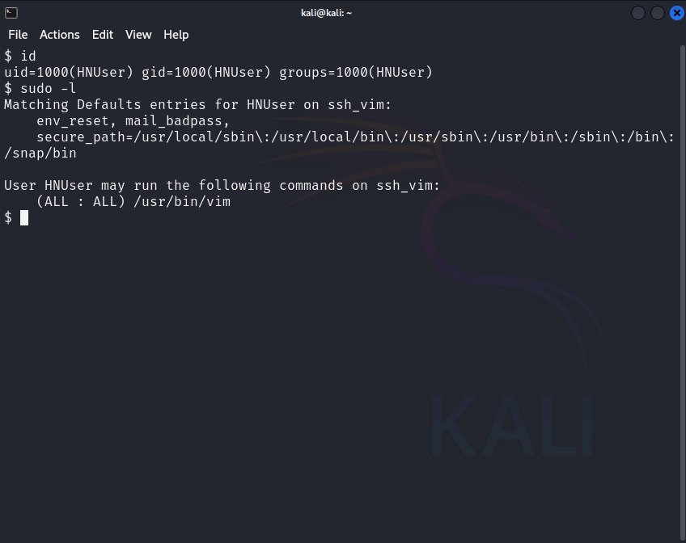
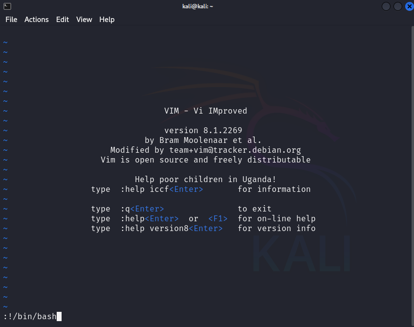
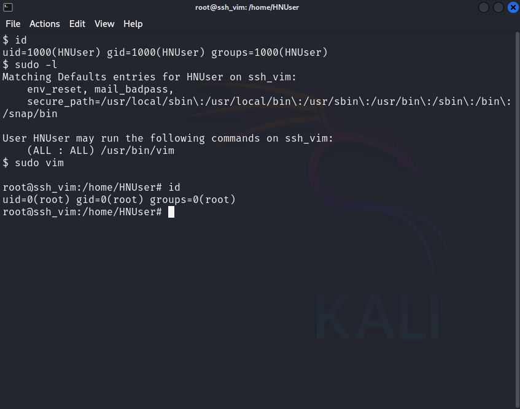

## Elevation of Privilege (EoP) in Linux
Privilege escalation, also known as Elevation of Privilege (EoP), refers to a situation where a user gains privileges they are not authorized to have. In the context of computer security, this often means a regular user obtaining administrative or root privileges, allowing them to perform actions that could compromise the security or stability of the system. EoP exploits can arise from software vulnerabilities, configuration errors, or design flaws.

### CVE-2019-12735: A Real-World Example
 [CVE-2019-12735](https://www.exploit-db.com/exploits/46973) is a notable example of a vulnerability in the Vim and Neovim text editors that could be exploited for privilege escalation. This vulnerability arose from improper handling of modelines, special lines in a text file that can set editor options. An attacker could craft a text file with malicious modelines that, when opened in Vim or Neovim, could execute arbitrary commands with the privileges of the user running the editor. If the editor was run with elevated privileges (e.g., using sudo), the commands would execute with those elevated privileges, leading to a potential compromise of the system.

## Demonstration 

### Attack Methodology
The attack can be carried out in several different ways. We can change any configuration file and grant ourselves access rights. For example, we can copy our SSH public key to the server and connect using the SSH program if that option is enabled. We can add a new user to the system and grant them root rights, or we can change the group membership of an existing user to give them root rights, etc.

Using an SSH client, we will connect to a vulnerable machine in the Azure cloud. The vulnerable machine is a Docker container.
We will perform a simpler and non-destructive attack by launching a new terminal shell through the Vim editor, where we will have root privileges.

### Steps to Reproduce

First, let's check if there is a possibility for the user to run the sudo command and, if so, what programs/commands can be run with elevated privileges. We will use the command sudo -l (a lowercase L – list) for this.


_Figure 1._

1. Open Vim Editor with Sudo ("**sudo vim**"):


_Figure 2._


_Figure 3._

2. Execute the Shell Command in Vim:

    - Press the ESC key to ensure you are in command mode.
    - Then, type the following (without the quotes): **:!/bin/bash** as shown in Figure 2: Vim editor opened and command entered to launch terminal shell.
    - Press ENTER.


Expected Result

You will see that your privileges have successfully been elevated to the root user, as depicted in Figure 3.

## How And Why It Works
1. **Verification of Sudo Permissions and Starting Vim**:
By running sudo -l, we confirm that the user has permission to run Vim with sudo. When sudo vim is executed, the Vim process starts with root privileges due to the sudo command.

2. **Executing Shell Commands within Vim**:
Vim allows users to execute shell commands from within the editor using the :! command. Inside Vim, the command :!/bin/bash is entered. The :! command in Vim runs a shell command, and since Vim is running with root privileges, the command executed (in this case, /bin/bash) inherits those privileges.

3. **Resulting Root Shell**:
The result is a root shell because the shell command executed from within Vim is done with the same elevated privileges that Vim has, which were granted by sudo. This misuse potential demonstrates how running Vim with sudo can straightforwardly escalate privileges if the user has permission to run Vim with sudo.

## Mitigation Strategies
The specific vulnerability CVE-2019-12735 in Vim and Neovim was patched. After the discovery of this vulnerability, the developers of Vim and Neovim released updates to address the issue. Users should update their versions of Vim and Neovim to ensure they are not susceptible to this exploit. Here’s a summary of the mitigation steps to take:

1. **Patching**: The vulnerability was patched in subsequent releases of Vim and Neovim. Users should update their installations to the latest versions to benefit from these security fixes.

2. **Disable Modelines**: One of the vectors for this vulnerability was the use of modelines. By default, modelines can execute certain commands when a file is opened. Disabling modelines in the Vim configuration prevents this:

    Add the following to your ~/.vimrc or /etc/vim/vimrc:

    ```bash title="vim"
    set nomodeline
    ```
    
3. **Limit Sudo Permissions**: Users should configure sudo carefully to restrict access to sensitive commands and applications. The sudoers file can be edited to limit which commands specific users can run with sudo.

4. **Regular Audits and Monitoring**: Regularly audit the use of sudo and monitor system logs for any unusual activity. Implement security tools and intrusion detection systems to catch unauthorized privilege escalation attempts.

By applying these patches and following best security practices, the risk associated with CVE-2019-12735 and similar vulnerabilities can be effectively mitigated.

## Conclusion
By following these steps, you have successfully escalated your privileges to the root user using Vim and sudo. Remember, this method should be used ethically and legally, respecting the policies and regulations of your organization.

Privilege escalation through Vim and sudo showcases how powerful features and potential misconfigurations can be leveraged. It's crucial to follow best security practices, conduct regular audits, and keep systems up-to-date to mitigate such vulnerabilities. Always use elevated privileges responsibly and ensure that security measures are in place to prevent unauthorized access.