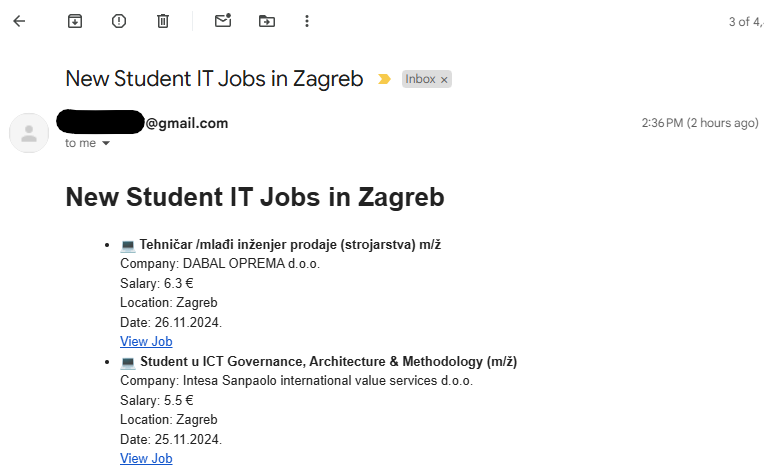
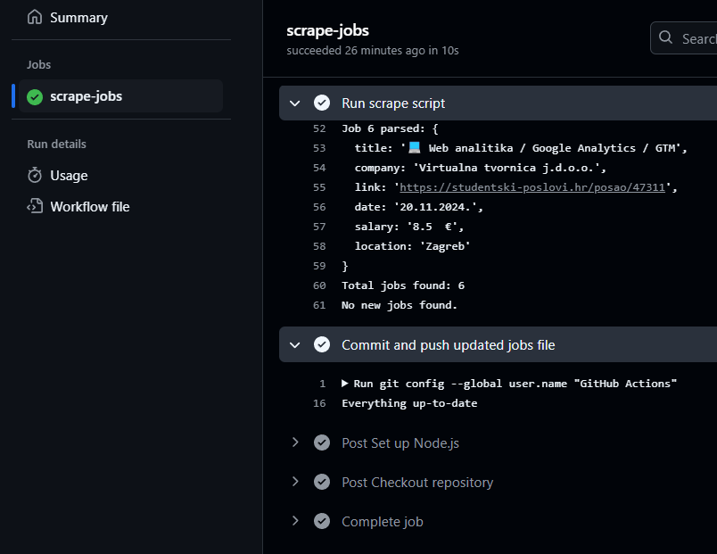

## The Problem: Finding New Jobs Efficiently
As a student, keeping track of job opportunities is important, especially when I'm looking for internships or part-time work. I wanted to automate this process so I don't have to keep opening the website every time to check if I missed a job posting. 

By creating a job scraping service that checks for new student IT job listings and emails me whenever new opportunities become available, this becomes easier.

I wanted a system that could:

- Automatically scrape job listings from a website (in this case, studentski-poslovi.hr, an IT job portal in Croatia).
- Parse and filter these listings for new job opportunities.
- Send me an email notification if there were any new jobs that hadn't been seen before.

And the best part? I wanted all of this to run automatically every day, without me having to worry about it.

This blog post will walk you through how I built the entire system using **Node.js**, **GitHub Actions**, and Gmail for email notifications.

## Step 1: Scraping Job Listings with Node.js

The first step was to set up a Node.js project to scrape job listings from the website. I used a few packages that helped make the process smoother and created a main.js script:

- Sends an HTTP request to the website to fetch job data with Axios.
- Parses the data with cheerio, extracting details like job title, company, location, salary, and the job link with Cheerio.
- Compares the current jobs to the previously saved jobs to find new listings.
- Sends an email with the new job listings using Nodemailer.

Example of the core logic, full code can be found on my GitHub repo:
```javascript title="main.js"
const axios = require('axios');
const cheerio = require('cheerio');
const nodemailer = require('nodemailer');
const fs = require('fs').promises;

const URL = 'https://studentski-poslovi.hr/pretraga?category=it-poslovi&province=zagreb&activated_from=all&min_hour_rate=';

async function scrapeJobs() {
  try {
    const response = await axios.get(URL);
    const $ = cheerio.load(response.data);
    const jobs = [];

    $('.job-post').each((index, element) => {
      const title = $(element).find('[dusk^="job-title-"]').text().trim();
      const company = $(element).find('.text-sm.font-medium').text().trim();
      const link = $(element).attr('data-url');
      const date = $(element).find('.text-sm.text-slate-600').first().text().trim();
      const salary = $(element).find('.text-slate-600 .uil-money-bill').parent().text().trim();
      const location = $(element).find('.text-slate-600 .uil-map-marker').parent().text().trim();

      jobs.push({ title, company, link, date, salary, location });
    });

    return jobs;
```

## Step 2: Handling New Jobs

The main challenge was finding new jobs that hadn't been seen before. Here's how I handled it:
- Every time the script runs, it scrapes the page and stores the current list of jobs.
- I compare this new list of jobs with the previously saved list (previous_jobs.json).
- If there are new jobs that aren’t in the previous list, I send an email with those job listings.

This ensures that I only get notified about new opportunities that I haven’t already seen.

## Step 3: Sending Email Notifications
Once the script identifies new job listings, it sends me an email with the details. I used Nodemailer to create and send the email, making sure that the email includes the following:
- Job title
- Company name
- Salary (if available)
- Location
- A link to view the job

Here’s the basic structure of the email:


This way, I receive an email every time there are new jobs that match the criteria.

Also make sure to add .env files into Github Actions for sending notifications:
```bash title=".env"
EMAIL_USER=xxx
EMAIL_APP_PASSWORD=xxx
EMAIL_TO=xxx
```
## Step 4: Automating the Process with GitHub Actions
The most important part was automating the entire process so that I didn’t have to run the script manually every day. This is where **GitHub Actions** came in handy.

I set up a **cron job** in GitHub Actions that triggers every 6 hours. This cron syntax ensures that the job scraping script runs at 00:00, 06:00, 12:00, and 18:00 UTC every day, fetching the latest job listings.

The GitHub Actions workflow file (scrape-jobs.yml) looks like this:
```bash title="scrape-jobs.yml"
name: Scrape Jobs and Send Email

on:
  schedule:
    - cron: '0 */6 * * *'  # Runs every 6 hours at the start of the hour
  workflow_dispatch:  # Allows manual triggering

jobs:
  scrape-jobs:
    runs-on: ubuntu-latest

    steps:
      - name: Checkout repository
        uses: actions/checkout@v3

      - name: Ensure package.json exists
        run: test -f package.json || echo "{}" > package.json

      - name: Set up Node.js
        uses: actions/setup-node@v3
        with:
          node-version: '20.16.0'

      - name: Install dependencies
        run: npm ci

      - name: Run scrape script
        env:
          EMAIL_USER: ${{ secrets.EMAIL_USER }}
          EMAIL_APP_PASSWORD: ${{ secrets.EMAIL_APP_PASSWORD }}
          EMAIL_TO: ${{ secrets.EMAIL_TO }}
        run: node main.js
        continue-on-error: true  # Avoid failing the action if no new jobs

      - name: Commit and push updated jobs file
        run: |
          git config --global user.name "GitHub Actions"
          git config --global user.email "github-actions@github.com"
          # Add only the specific file that was modified (previous_jobs.json)
          git add previous_jobs.json
          # If there are no changes to commit, skip the commit step
          git diff --cached --quiet || git commit -m "Update previous jobs file"  # Commit only if changes exist
          # Push changes to the repository
          git push https://x-access-token:${{ secrets.GH_TOKEN }}@github.com/marinkres/studentjobs.git
        env:
          GITHUB_TOKEN: ${{ secrets.GITHUB_TOKEN }}  # GitHub token for authentication

```
## Step 5: Storing Job Data
Since GitHub Actions runs in a clean environment each time, the previous_jobs.json file is not automatically preserved between runs. 

To solve this, I added a step in my GitHub Actions workflow that commits and pushes the previous_jobs.json file back to the repository. This way, the file is updated with each run and remains available in the repository.

## Handling Errors and Ensuring Smooth Operation
I made sure that even if no new jobs are found, the workflow continues without failing. I used the continue-on-error: true flag in the script run step to ensure the action doesn't stop when no new jobs are found.

Another problem was setting permissions for the GitHub Actions Bot so it can push and edit the files automatically. This was solved by setting the permissions in the settings to Read & Write, and adding GITHUB_TOKEN to the .env.

In addition, I also added a check before committing and pushing changes. The script only commits if there are actual changes (i.e., new jobs), avoiding unnecessary commits.

