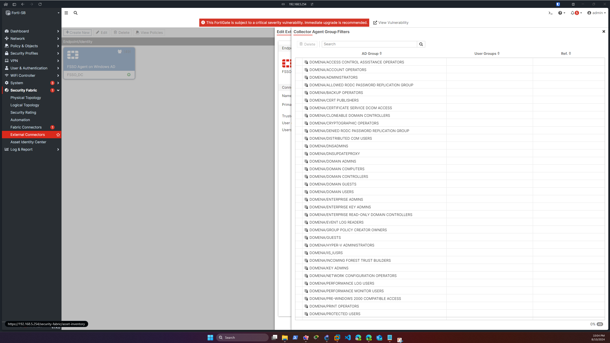
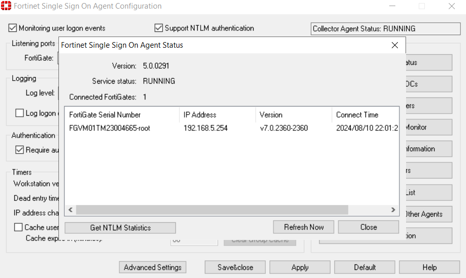

Welcome to the second edition of my NGFW lab series. In our previous session, we discussed and set up the network topology using GNS3. This time, we’ll dive into configuring Fortinet Single Sign-On (FSSO) to enhance our network security and streamline user authentication.

## Introduction to Fortinet Single Sign-On (FSSO)
Fortinet Single Sign-On (FSSO) is a robust authentication solution that allows users to log in once and gain access to multiple systems without needing to re-enter credentials. This seamless authentication process enhances security and user experience by integrating with various authentication systems such as Windows Active Directory (AD), Citrix, VMware Horizon, Novell eDirectory, and Microsoft Exchange.

FSSO works by monitoring user logon events and passing this information to the FortiGate device. When a user logs on to a workstation within a monitored domain, FSSO detects the logon event, resolves the workstation name to an IP address, determines the user groups the user belongs to, and sends this information to the FortiGate unit. This allows the FortiGate to apply appropriate security policies based on the user’s group membership.

## Step-by-Step Setup of FSSO
### Step 1: Understand Your Network Layout
Before starting the configuration, it’s essential to understand your network layout. Since the last lab, I updated the topology to accomodate the FSSO functionality.


- FortiGate-SB Firewall
- Windows-VM-2 User: IP address 192.168.152.10/24.
- DC Server: IP address 192.168.5.10/24.

New additon is added to the Široki Brijeg Poslovnica. A Windows 2019 Server Datacenter that will be our Domain Controller for the Široki Brijeg Active Directory.

**Before any FSSO setup, make sure Active Directory is installed and configured, DC set as the Domain Controller and WindowsVM-2 added to the domain.**

**Create a test OU, group and users. Make sure the Firewall is turned off on the DC server as to not block FSSO traffic.**

>Don't forget to edit the FortiGate policies so that DC and WIN machine can communicate. We covered that in the last lab.

### Step 2: Install the FSSO Collector Agent

To download the installer, you need to have a registered fortinet account. Once logged in to support.fortinet.com, select Support -> Firmware Download ->Select Product, and select FortiGate -> Download.

Once starting the Fortinet SSO Collector Agent Setup Wizard:

1. By default, the agent is installed using the currently running account. We will change the User Name using the format DomainName \ UserName. For example if the account is jsmith and the domain is example_corp you would enter example_corp\jsmith.
2. In the Password field, enter the password for the account listed in the User Name.
3. Select Standard method.
4. Don't install the DC agent as we won't use that in this case.


### Step 3: Configure the Collector Agent:

Once installed, navigate to the Fortinet Single Sign On Agent Configuration:


Make sure the it shows RUNNING and set up a password that will match the one on FortiGate.
The 8000 and 8002 ports are default UDP ports for FSSO.

Log in to the FortiGate GUI and navigate to Security Fabric -> External Connectors -> Add new.


Primary FSSO agent ip address should be that of our DC server, and the password the same one we set in the FSSO Configuration window.




After clicking Save & Apply, you should see the FortiGate automatically added the group filters, and in DC the Status displays our Connected FortiGate. 

By following these detailed steps, you can ensure that the FSSO Collector Agent is properly configured to monitor user logon events and communicate effectively with your FortiGate device. This setup is crucial for enabling seamless and secure authentication across your network, enhancing both security and user experience. 

If you encounter any issues, refer to the logs and diagnostic tools for further troubleshooting, or check [this post](https://community.fortinet.com/t5/FortiGate/Technical-Tip-Common-reasons-FSSO-status-shows-as-down-on-the/ta-p/193790) for potential fixes.

## Testing FSSO

To ensure that Fortinet Single Sign-On (FSSO) is functioning correctly, you can try logging with the test users accounts we created earlier and use the command 
```bash
diagnose debug authd fsso list 
```
on the FortiGate CLI to display the current logon sessions and verify that the user information is correctly mapped.


To further validate, create a firewall policy that applies to the user group authenticated via FSSO and attempt to access resources governed by this policy. Monitor the logs to ensure that access is granted or denied as expected based on the user’s group membership. These steps will help confirm that FSSO is accurately capturing and utilizing user authentication data.

### Next Topics

In the next post, we will dive into more advanced networking features and concepts:

- **SD-WAN** (Software-Defined Wide Area Network): How it can optimize and secure WAN connections, providing better performance and flexibility.
- **Site-To-Site VPN's** Understanding the setup and configuration of site-to-site VPNs to securely connect multiple locations over the internet.


