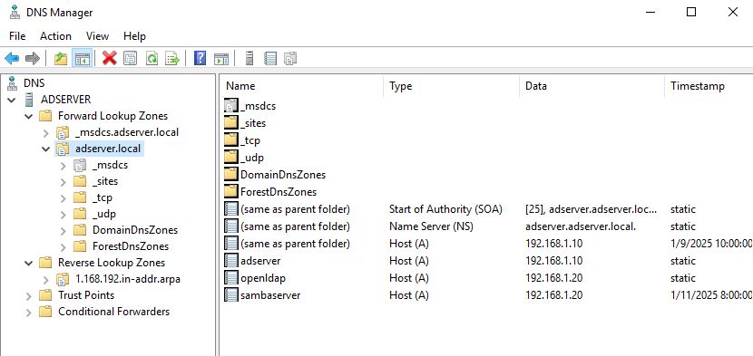
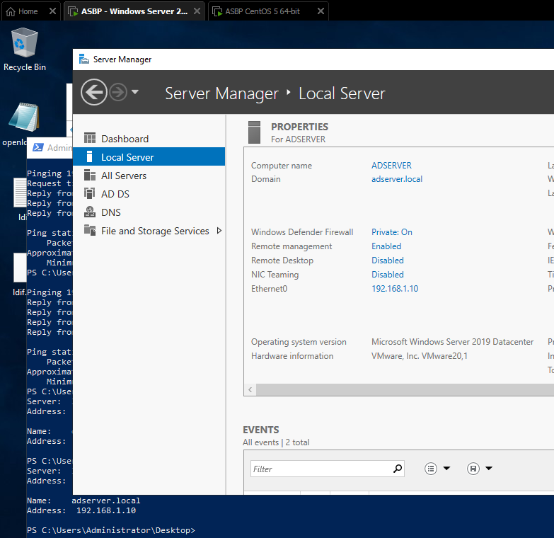
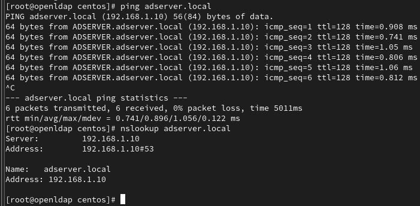
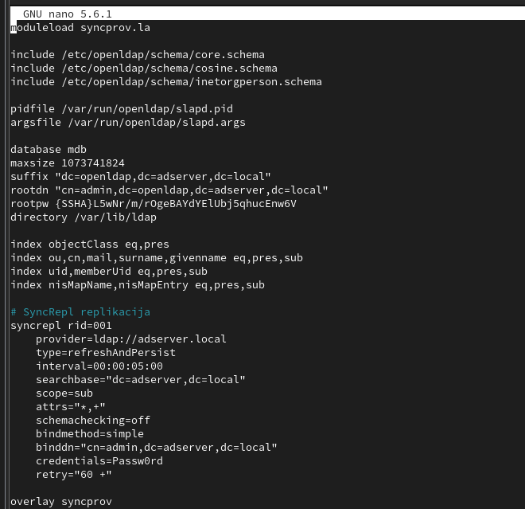
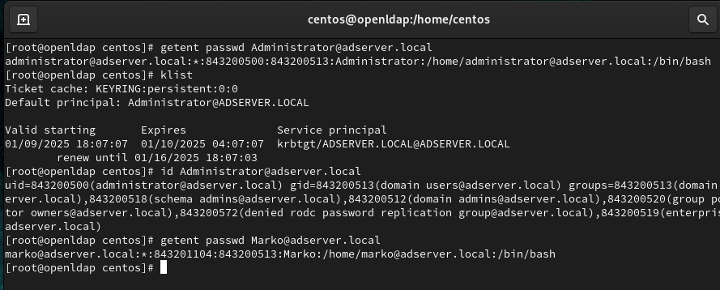
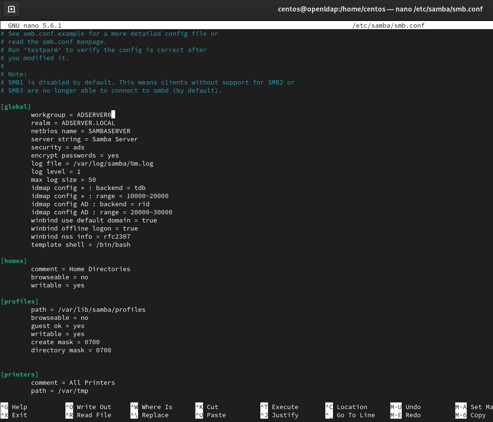

## Introduction

In hybrid IT environments, where Linux and Windows servers coexist, managing user authentication across platforms can pose significant challenges. A centralized authentication system ensures simplicity, security, and efficiency by synchronizing user accounts and credentials between systems. 

This project implementation successfully integrated Windows Server 2019 Active Directory (AD) with an OpenLDAP system on CentOS Linux using Samba tools, achieving bidirectional user account synchronization and centralized authentication management. Key technical elements include configuring DNS for inter-server communication, setting up Kerberos authentication for secure interaction, and using Samba services to join the Linux server to the AD domain. Experimental results demonstrate functional user synchronization between systems, while alternative approaches such as FreeIPA were identified as less practical due to the complexity of managing LDIF files.

This is not a step by step guide, but a over simplified explanation of the project workings.

## Architecture of the Heterogeneous System

### Two-Component Model: Windows and Linux Server Infrastructure
The implementation uses the VMware Workstation Pro 2017 virtualization platform with two virtual machines:

Windows Server 2019 (ADSERVER.local)

- IP: 192.168.1.10/24
- DNS: 127.0.0.1 (loopback for local resolution)
- Services: Active Directory Domain Services, DNS Server

CentOS 8 (openldap.adserver.local)
- IP: 192.168.1.20/24
- DNS: 192.168.1.10 (reference to Windows DNS)
- Services: OpenLDAP 2.4, Samba 4.12, SSSD, Kerberos 5

The network configuration uses bridge mode for direct L2 communication between virtual nodes, ensuring low latency and seamless SMB/CIFS protocol operation.

### DNS Hierarchy and Zone Delegation

The Windows DNS server is configured as authoritative for the adserver.local zone, with an explicit A record for the Linux server (openldap.adserver.local → 192.168.1.20). The reverse zone for 192.168.1.0/24 enables PTR queries for reverse lookup functionality. PowerShell commands for creating zones:
``` powershell
Add-DnsServerPrimaryZone -NetworkID "192.168.1.0/24" -ReplicationScope "Forest"
Add-DnsServerResourceRecordA -Name "openldap" -IPv4Address "192.168.1.20"
```
This approach eliminates dependence on external DNS resolvers and enables dynamic registration of clients through Samba integration.


## Configuring Windows Active Directory
### Initial Procedure for Promotion to DC

After the basic installation of Windows Server, the DCPROMO tool was used to promote the server to a Domain Controller with the creation of a new forest, adserver.local. Significant configuration points include:

FSMO Role Assignment: Schema Master, Domain Naming Master, PDC Emulator

Dynamic DNS Registration: Enabled for client stations

Forest Trust: Not implemented due to the simplicity of the test environment

The functionality of AD can be verified through the Active Directory Users and Computers console, where test users (e.g., "Marko," "Darko") were created.



## Linux OpenLDAP and Samba Integration
### Basic OpenLDAP Installation Procedure

On the CentOS server, OpenLDAP was installed through the yum repository with the following packages:

```bash
yum install -y openldap-servers openldap-clients sssd samba samba-client
```

Key configuration steps include:

1. slapd.conf:

```text
database mdb
suffix "dc=adserver,dc=local"
rootdn "cn=admin,dc=adserver,dc=local"
rootpw {SSHA}...
```
The slappasswd tool was used to generate the hashed administrator password.



2. LDAP Schema Import:

```bash
ldapadd -Y EXTERNAL -H ldapi:/// -f /etc/openldap/schema/cosine.ldif
```
3. Basic Organizational Unit:

```text
dn: ou=People,dc=adserver,dc=local
objectClass: organizationalUnit
ou: People
Kerberos authentication was configured through /etc/krb5.conf, directing KDC requests to the Windows Server.
```

Kerberos authentication was configured through /etc/krb5.conf, directing KDC requests to the Windows Server.


## Samba as AD Domain Member
Samba configuration in /etc/samba/smb.conf focused on the LDAP backend and AD integration:

```text
[global]
   workgroup = ADSERVER
   security = ads
   realm = ADSERVER.LOCAL
   idmap config * : backend = tdb
   idmap config * : range = 3000-7999
   winbind use default domain = yes
```
The domain joining process was performed with the command:

```bash
net ads join -U Administrator
```
Validation of successful joining was verified through wbinfo -u, which displays users from AD.



## User Account Synchronization
### Bidirectional Attribute Replication
Using the ldapsearch and ldapmodify tools, the synchronization of user entities was experimentally proven:

```bash
ldapsearch -x -H ldap://ADSERVER.adserver.local -b "dc=adserver,dc=local"
```
Example of a synchronized user in OpenLDAP:

```text
dn: uid=marko,ou=People,dc=adserver,dc=local
objectClass: inetOrgPerson
uid: marko
sn: Markovic
givenName: Marko
mail: marko@adserver.local
userPassword: {SSHA}...
```
The Samba smbldap-tools package enabled automatic mapping of SIDs from AD to UNIX UID/GID values, using the idmap_rid mechanism.

## Security Aspects and Authentication Protocols
### Kerberos TGS Exchange Process
Testing of Kerberos authentication was performed through:

```bash
kinit administrator@ADSERVER.LOCAL
klist
```
The output shows a successfully obtained TGT (Ticket Granting Ticket), while the kvno tool verifies service tickets for LDAP and SMB.

### SASL/GSSAPI Integration
OpenLDAP was configured to support the GSSAPI mechanism through olcSaslSecProps parameters in the cn=config DIT:

```text
olcSaslSecProps: noanonymous,minssf=112
```
This enables encrypted LDAP communication using Kerberos tickets.

## Alternative Approaches and Problems
### FreeIPA Integration Attempts
The experiment with FreeIPA showed the possibility of LDAP synchronization through the ipa-replica-manage tool, but the configuration complexity and manual management of ldif files were identified as major drawbacks compared to the Samba solution.

### Errors in DNS Configuration
Initial problems with reverse zones were resolved by adding explicit PTR records and checking the nslookup tool. Example fix:

```powershell
Add-DnsServerResourceRecordPtr -Name "20" -PtrDomainName "openldap.adserver.local"
```

## Performance and System Testing
### Load Balancing and Failover Scenarios
Although not implemented in this project, the theoretical framework for a multi-master Samba configuration was proposed using samba-tool domain level raise to raise the functional level to the Windows Server 2016 scheme.

### Measuring Authentication Latency
Using the time command during the kinit operation, the average time to issue a TGT was 120ms on the local network, which corresponds to expectations for a 1 Gbps environment.

## Conclusion and Recommendations
The implementation demonstrated the ability of OpenLDAP and Samba to integrate into heterogeneous environments, with several key recommendations for production use:

Automatic Synchronization: Implementing lsyncd for real-time replication of LDAP changes

Redundancy: Setting up a secondary Samba AD Domain Controller

Monitoring: Integration with Zabbix or Prometheus for monitoring LDAP/SMB metrics

This project serves as a reference model for system engineers who combine Microsoft and open-source technologies in corporate networks.