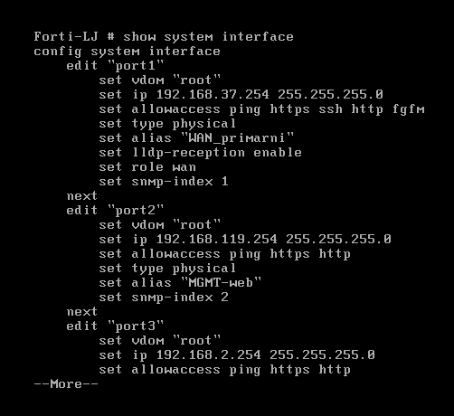
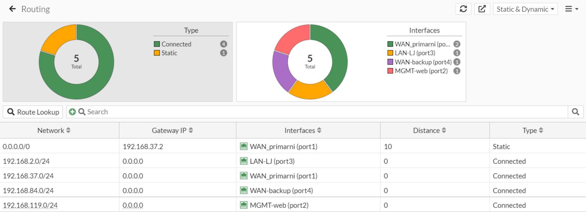
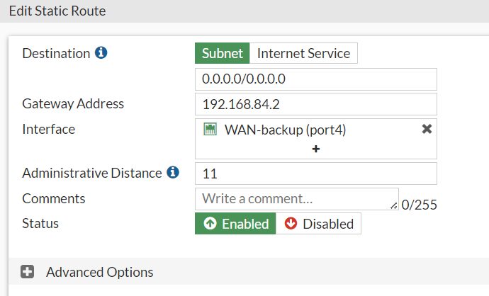
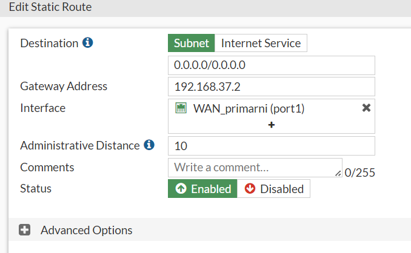
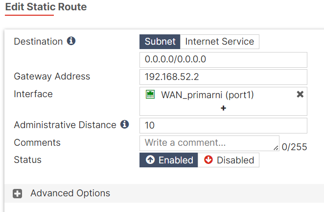
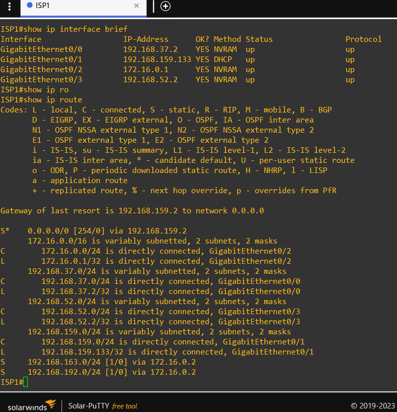
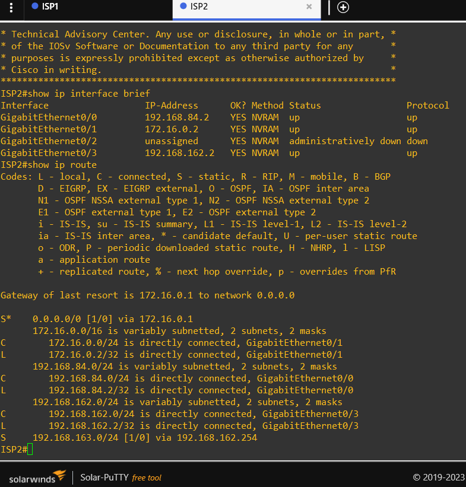
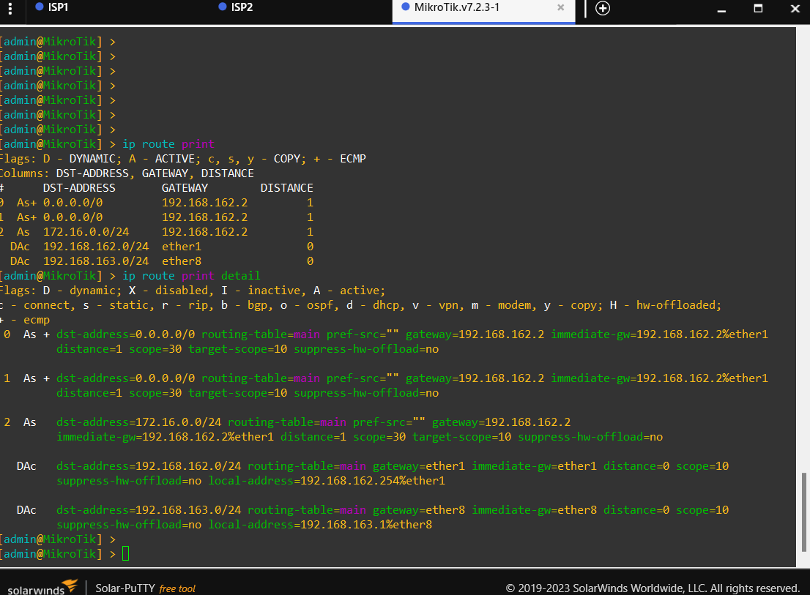

## Introduction 
### Setting Up a Virtual Lab for Cybersecurity Projects
This is the first installment of our project series (NGFW) on Next-Generation Firewalls. As cybersecurity threats continue to evolve, so must our defenses. We'll dive deep into the capabilities and configurations of next-generation firewalls and other security principles, helping you stay ahead in the constantly changing landscape of network security.

Before we can explore the sophisticated features of NGFWs, we need a robust and flexible virtual environment. This initial blog post will guide you through setting up a comprehensive network topology using **VMware workstation pro 17** and **GNS3**. 

We'll cover the essential steps for configuring routing and other fundamental settings to ensure a smooth and functional virtual lab. By the end of this guide, you'll have a solid foundation to build upon as we delve into advanced firewall configurations and security strategies in the upcoming posts.

## The topology
This topology serves as the foundational environment for our next posts. Let's break down each component and understand how they interconnect to create a comprehensive network simulation.


- **LAN LJUBUSKI** (192.168.2.0/24): Internal network with DHCP clients.
- **POSLOVNICA ŠIROKI BRIJEG** (192.168.5.0/24): Remote office network.
- **PARTNERSKA FIRMA** (192.168.163.0/24): Partner company network.

### 1. **LAN LJUBUSKI (192.168.2.0/24)**

This is the main "Central" site for our imaginary network.
Devices:

- **WindowsVM-1**: A virtual Windows 10 PC with an IP address of 192.168.2.2, connected to the network via interface e0. It uses DHCP to obtain its IP configuration from FortiGate-LJ, with a default gateway of 192.168.2.254. The Windows firewall needs to be turned off. Virtual NIC VMnet4.
- **PC1**: Another device in the LAN with an IP address of 192.168.2.1, connected via interface e0. Like WindowsVM-1, it also uses DHCP and has a gateway of 192.168.2.254.
- **Switch1**: A virtual switch (e2 and e7) connecting WindowsVM-1 and PC1 to the LAN. The switch's e0 interface is connected to the FortiGate firewall on Port3.

1. **FortiGate7.4-LJ Firewall**

    The FortiGate7.4-LJ is the central firewall for the LAN LJUBUSKI network. It has multiple interfaces configured as follows:

    - Port1: IP address 192.168.37.254, connected to ISP1 (192.168.37.0/24 subnet). Virtual NIC VMnet1
    - Port2: IP address 192.168.119.254. Management interface. Virtual interface VMnet10
    - Port3: IP address 192.168.2.254, connected to Switch1 and acting as the gateway for the LAN LJUBUSKI network. Virtual NIC VMnet2
    - Port4: IP address 192.168.84.254, connected to ISP2 (192.168.84.0/24 subnet). Virtual NIC VMnet3

### 2. **ISP1 and ISP2**

These serve as ISP providers for our lab.

**ISP1**:

- Interface Gi0/0: IP address 192.168.37.2, connected to FortiGate7.4-LJ Port1.
- Interface Gi0/1: Connected to the internet (NAT1).
- Interface Gi0/2: IP address 172.16.0.1/24, part of the 172.16.0.0/24 subnet.
- Interface Gi0/3: IP address 192.168.52.2, part of the 192.168.52.0/24 subnet.

**ISP2**:

- Interface Gi0/0: IP address 192.168.84.2, connected to FortiGate7.4-LJ Port4.
- Interface Gi0/1: IP address 172.16.0.2, connected to ISP1.
- Interface Gi0/3: IP address 192.168.162.2, part of the 192.168.162.0/24 subnet.

### 3. **POSLOVNICA ŠIROKI BRIJEG (192.168.5.0/24)**

 This servers as our secondary Site in a different city.
    Devices:

1. **FortiGate7.4-SB**: Another FortiGate firewall with the following configuration:
    - Port1: IP address 192.168.52.254, connected to ISP1 port G0/3. Virtual NIC VMnet7
    - Port2: MGMT port. Virtual NIC VMnet5.
    - Port3: IP address 192.168.5.254, connected to the local network. Virtual NIC VMnet6.
2. **KorisnikSB**: A client device with DHCP enabled, connected to Port3 of FortiGate7.4-SB. Virtual NIC VMnet14.

### 4. **PARTNERSKA FIRMA (192.168.163.0/24)**

Devices:

1. **MikroTik.v7.2.3-1**: A MikroTik router with the following configuration:
    - ether1: IP address 192.168.162.254, connected to ISP2 port G0/3.
    - ether8: IP address 192.168.163.2 Connected to the internal network of the partner firm.
2. **WindowsVM-2**: A virtual machine within the partner firm’s network, connected to ether8 of the MikroTik router, with an IP address of 192.168.163.5.
The Windows firewall needs to be turned off.
## VMware & GNS3
VMware and GNS3 are powerful tools used for network simulation and virtualization, each serving distinct but complementary roles in designing and testing network topologies. VMware is a suite of virtualization products that allows you to create and manage virtual machines (VMs) on physical hardware. 

When VMware and GNS3 are used together, VMware virtual machines can serve as end-user devices, servers, or network appliances within a GNS3 topology. This integration allows for a more comprehensive and realistic simulation of network environments, including the ability to test interactions between virtualized network devices and operating systems.

### Virtual Network Cards in GNS3
Virtual network cards, or virtual NICs (Network Interface Cards), are essential components in GNS3 setups. They represent network interfaces on virtual machines and network devices within the simulation environment. These virtual NICs allow virtual devices to communicate with each other and with external networks.

In GNS3, you typically create virtual network cards when configuring virtual machines or network devices. Each virtual network card is connected to a virtual network or switch within GNS3, facilitating the flow of network traffic between different elements of the simulated network.

When integrating VMware with GNS3, virtual network cards play a critical role in ensuring connectivity between the VMware VMs and the GNS3 network. For instance, if you have a VM running a server OS in VMware, you can assign a virtual network card to this VM and connect it to a virtual switch or router in GNS3. This setup allows the VM to interact with other virtual devices and test various network configurations and protocols. In our case we are using VMnet cards as host-only.


## Network Policy and Routing
The virtual lab topology comprises multiple network segments connected through firewalls and routers. Each segment serves a specific purpose, and the Routing is essential for ensuring that data packets can traverse the network between these segments and ensures seamless communication.

### Firewall-LJ config.

We can configure the FortiGate firewall by ssh in the terminal or by opening the GUI in the browser. For example in this case from our management port https://192.168.119.254/.

Example of terminal port configuration:



In this section, we'll delve into the routing configuration of the FortiGate7.4-LJ firewall, illustrated by the routing table screenshot. This configuration is crucial for directing network traffic efficiently across various segments, ensuring secure and optimal data flow within our virtual lab setup.

#### Overview of the Routing Table



The routing table on the FortiGate7.4-LJ firewall comprises both static and connected routes, categorized as follows:

- Connected Routes: These routes represent directly connected network segments, automatically added to the routing table when the interfaces are configured with IP addresses.
- Static Routes: These are manually added routes to direct traffic to specific networks or through specific gateways.

#### Understanding Static Routes and Administrative Distance
In networking, static routes and administrative distance play crucial roles in directing traffic and managing routing preferences. This section provides an overview of these concepts and their application in our FortiGate7.4-LJ firewall setup.

#### Static Routes
Static Routes are manually configured routes that specify the exact path traffic should take to reach a particular network destination. Unlike dynamic routing protocols, which automatically adjust routes based on network conditions, static routes remain fixed until they are manually changed. This provides greater control over routing decisions and can enhance network stability and security.

Key Features of Static Routes:

- Simplicity: Easy to configure and manage, especially in smaller or less dynamic networks.
- Control: Provides precise control over routing paths, ensuring traffic flows as intended.
- Predictability: Routes remain constant, making it easier to predict and troubleshoot network behavior.

In our FortiGate7.4-LJ firewall setup, we have configured static routes to direct traffic through specific gateways based on their destinations.

#### Administrative Distance
Administrative Distance (AD) is a value that routers use to select the best path when there are multiple routes to the same destination from different routing protocols. It is essentially a measure of the trustworthiness of a route; lower AD values are preferred over higher ones.

Key Features of Administrative Distance:

- Prioritization: Helps prioritize routes from different sources, ensuring the most reliable path is chosen.
- Fallback Mechanism: Enables the configuration of backup routes that are only used if the primary route fails.
- Flexibility: Allows network administrators to influence route selection and traffic management.

In our FortiGate7.4-LJ firewall setup, we use administrative distance to manage primary and backup routes. The primary route has a lower AD (10), making it the preferred route. The backup route has a higher AD (11), ensuring it is only used if the primary route is unavailable.




#### FortiGate7.4-LJ Firewall Routing Configuration
To illustrate these concepts, let's examine the specific routing configuration on the FortiGate7.4-LJ firewall.

1. Primary Route Configuration:

- Destination: 0.0.0.0/0
- Gateway Address: 192.168.37.2
- Interface: WAN_primarni (port1)
- Administrative Distance: 10

2. Backup Route Configuration:

- Destination: 0.0.0.0/0
- Gateway Address: 192.168.84.2
- Interface: WAN-backup (port4)
- Administrative Distance: 11

The primary route directs all outbound traffic through the primary WAN interface (port1) with the gateway 192.168.37.2. Its lower AD of 10 ensures it is the preferred route under normal conditions.

The backup route serves as a fallback, directing traffic through the backup WAN interface (port4) with the gateway 192.168.84.2. Its higher AD of 11 ensures it is only used if the primary route fails.

### FortiGate7.4-SB Firewall Routing Configuration
In our FortiGate7.4-SB firewall, we have a crucial static route configured to manage outbound traffic efficiently. There is no backup route configured for this segment.

Static Route Details:

- Destination: 0.0.0.0/0
- Gateway Address: 192.168.37.2
- Interface: WAN_primarni (port1)
- Administrative Distance: 10
- Status: Enabled



This static route is configured to direct all outbound traffic from the FortiGate7.4-SB firewall to the Internet through the primary WAN interface (port1). The gateway IP address 192.168.37.2 is specified, indicating the next hop for traffic leaving the network. The administrative distance is set to 10, making it the preferred route when multiple routes to the same destination exist.

### ISP1 & ISP2 Routing Configuration

Assuming previous knowledge of Cisco routing configuration, I will skip the step by step guide. Here are the routes configured on both ISP's:




### Mikrotik Routing Configuration

This one was a new experience for me since I never used mikrotik products. The command line is very similar to Cisco one as expected. Here are the ones necessary for setting up the routing configuration:

- Assign IP addresses to the router interfaces.

```bash title="Mikrotik Terminal"
/ip address add address=192.168.162.254/24 interface=ether1
/ip address add address=192.168.163.1/24 interface=ether8
```

- Adding Static Routes:

Define static routes to reach specific networks. Specify the destination network and the gateway (next hop).

```bash title="Mikrotik Terminal"
/ip route add dst-address=172.16.0.0/24 gateway=192.168.162.2
/ip route add dst-address=0.0.0.0/0 gateway=192.168.162.2
```



Another way to configure Mikrotik routers is to use their GUI interface with the WinBox app. But we won't use that in our project.

### Firewall Policy Configuration


TO BE CONTINUED AND EDITED


