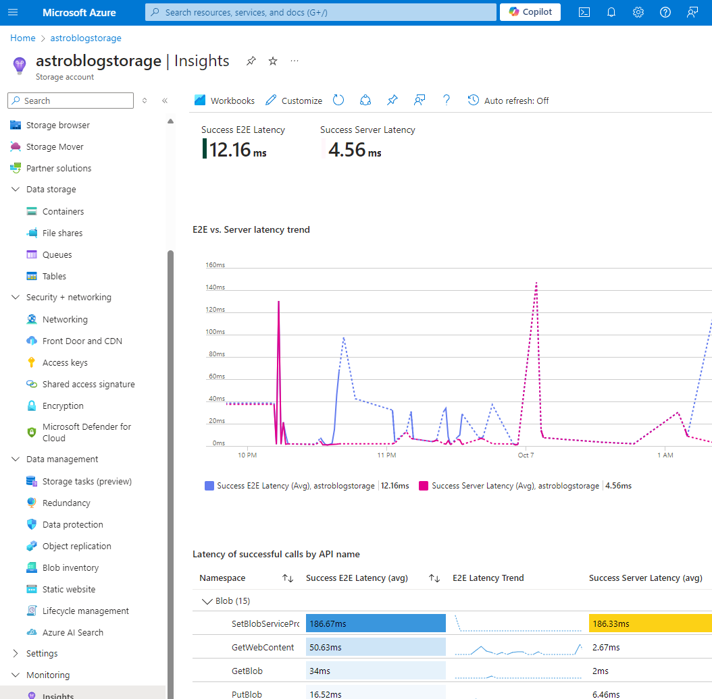
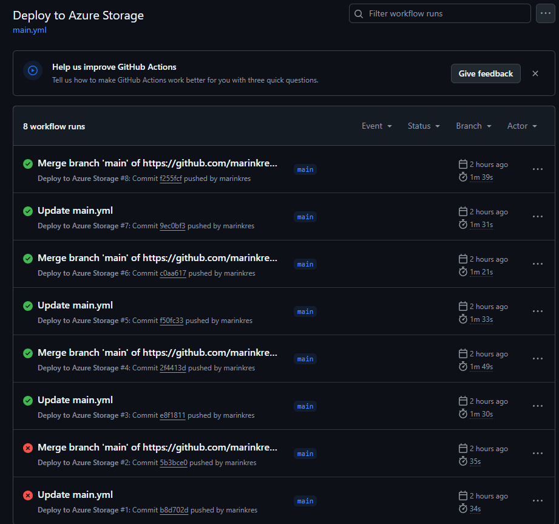

## Introduction
I recently made the decision to migrate my blog from Netlify to Azure. The primary motivation behind this migration was to delve into DevOps practices and gain practical knowledge in cloud computing, as well as my recent AZ-900 certification exam experience. In this post, I’ll share the challenges I faced and the benefits I’ve gained from this move.

## Why the move?

When I first launched marink.me, I chose Netlify for its simplicity and powerful features. However, as I delved deeper into the world of DevOps, I began to realize the need for more customization, scalability, and a wider array of services. Here are a few reasons why I decided to make the switch:

2. Integration with Azure Services: Hosting my blog on Azure allows for seamless integration with other services like Azure Functions and Azure Logic Apps, enabling more complex workflows and capabilities.

3. Infrastructure as Code (IaC): I wanted to adopt Infrastructure as Code practices, and Azure’s ARM templates allow me to manage my resources programmatically, providing a clear and replicable deployment strategy.

5. API Integration: Utilizing Azure APIs enables me to expand my blog’s functionality and integrate it with other applications and services in the future.

6. Learning Opportunity: As an aspiring IT professional, gaining hands-on experience with Azure was a great way to expand my skill set and familiarize myself with cloud computing concepts.

7. CI/CD Implementation: I wanted to streamline my development process, and integrating GitHub Actions for Continuous Integration and Continuous Deployment (CI/CD) was a key part of my migration strategy.

## The Migration Process
The first step in the migration process was organizing my resources using Azure Resource Groups. Resource Groups help manage and group related resources, making it easier to monitor, manage, and deploy resources together. 
After creating the resource group, I proceeded to set up a new Azure Storage account: 


### Infrastructure as Code (IaC)
To manage my Azure resources using Infrastructure as Code, I created an ARM template that defined my storage account and static website configuration. This template includes:

- Storage Account Resource: Configured with properties like SKU, kind, and static website settings.
- Outputs: Providing the primary endpoint for the static website, making it easy to reference in other scripts or documentation.

### Deploying
After setting up the Azure resources, I uploaded my blog files to the Azure Storage static website.
I ensured that my directory structure was organized, which helped maintain clarity and made future updates easier. The index.html file serves as the entry point for my blog.

### Configuring Azure CDN
To enhance the performance of my blog, I configured Azure CDN to cache and distribute content globally. This step allows for faster delivery of static content like images, CSS, and JavaScript files to users across different geographical locations. The CDN caches these assets, reducing latency and improving load times.

Here’s how I set up the Azure CDN:

- CDN Profile Creation: I created a new CDN profile in the Azure portal and selected the pricing tier based on my expected usage.
- Endpoint Configuration: I set up a CDN endpoint pointing to my Azure Storage static website. This endpoint serves as the public URL for my blog's assets.
- Caching Rules: I configured caching rules to control how long content should be cached, optimizing performance while ensuring that updates to my blog are reflected quickly.

### Configuring GitHub CI/CD
To streamline my workflow, I implemented CI/CD using GitHub Actions. This allowed me to automate the deployment process, ensuring that every change pushed to the main branch of my repository automatically updates the blog on Azure. Here’s a brief overview of how I set it up:

- GitHub Repository: I created a GitHub repository to store my blog’s source code.

- Workflow File: I created a .github/workflows/main.yml file in my repository, which contains the following steps:

```bash title="main.yml"
name: Deploy to Azure
on:
  push:
    branches:
      - main
jobs:
  build-and-deploy:
    runs-on: ubuntu-latest
    steps:
      - name: Checkout Code
        uses: actions/checkout@v2
      - name: Set up Azure CLI
        uses: azure/setup-azure@v1
        with:
          azcliversion: latest
      - name: Login to Azure
        run: az login --service-principal -u ${{ secrets.AZURE_CLIENT_ID }} -p ${{ secrets.AZURE_CLIENT_SECRET }} --tenant ${{ secrets.AZURE_TENANT_ID }}
      - name: Deploy to Azure
        run: |
          az storage blob upload-batch -s ./public -d '$web' --account-name azureblog --overwrite

```
- Trigger: The workflow is triggered on push events to the main branch.
- Checkout Code: The workflow checks out the code from the repository.
- Azure CLI Login: The workflow logs into Azure using a service principal with credentials stored as secrets in GitHub.
- Deploy: Finally, the workflow uploads the updated files to the Azure Storage account's $web container, making them publicly accessible.

#### Problem and Solution
During the setup, I encountered an issue where the deployment was failing due to existing blobs not being replaced with the new versions. The solution was to add the --overwrite flag to the az storage blob upload-batch command in the workflow. This option ensures that any existing files in the $web container are replaced with the new versions, allowing for a successful deployment every time changes are pushed.

This automation ensures that my blog is always up-to-date with the latest changes and saves me from manually deploying updates.



### Domain Configuration
To ensure my blog remains accessible at my custom domain (marink.me), I configured DNS settings with my domain registrar, Namecheap. This involved:

- Updating CNAME Records: I pointed the CNAME records to the Azure CDN endpoint, ensuring that all traffic is routed through the CDN for optimal performance.

## Testing and Optimization
After migrating all the content, I conducted extensive testing to ensure everything was functioning correctly. I checked all links, images, and interactive elements to confirm they were working as expected. Additionally, I focused on optimizing the website for speed and performance by:

- Enabling Caching: Configuring appropriate caching settings in Cloudflare.
- Image Optimization: Compressing images to reduce loading times without sacrificing quality.

In the future I will expand on more services, implementations and security within Azure. Stay tuned for the next post!

