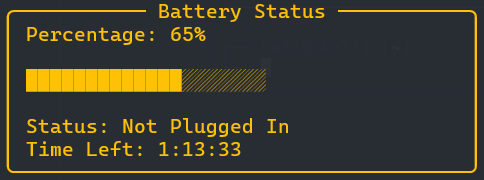

## Exploring Terminal App Development
As a system engineer, streamlining workflows and optimizing system monitoring are key goals. Recently, I ventured into terminal applications and created UtiBat, a CLI tool for monitoring laptop battery status.

### Why Terminal Apps?
Terminal applications offer a lightweight and efficient way to interact with your system. They bypass the overhead of graphical user interfaces, providing a streamlined approach that's perfect for system engineers and power users. Additionally, building terminal apps can enhance your command-line skills and deepen your understanding of system internals.

**The Idea Behind UtiBat**:
I wanted a quick and easy way to see my battery percentage without leaving the command line.

To build UtiBat, I used **Python** along with a few essential libraries:

- Click: For creating command-line commands.
- Psutil: For accessing system battery information.
- Rich: For advanced terminal output formatting.

## Running UtiBat

>To use UtiBat in **local development**, simply run the following command in your terminal: python utibat.py battery


To install the latest version of UtiBat you can use pip:
```bash title="Terminal"
pip install utibat
```
### Usage: 
```bash title="Terminal"
utibat
```
This command will display detailed battery information, including percentage, progress bar, status, and estimated time left.

### Example Output:


Or 

Check the [Github link](https://github.com/marinkres/utibat) and the [PyPI documentation](https://pypi.org/project/utibat/).

## Understanding Click
Click is a Python package that makes creating command-line interfaces straightforward. It allows you to define commands, handle arguments, and structure complex command-line applications with ease. In UtiBat, Click is used to define the cli command, which displays detailed battery information, including a progress bar and status updates.

## Leveraging Psutil
Psutil is a cross-platform library for retrieving system details such as CPU usage, memory, disks, and more. For UtiBat, Psutil’s psutil.sensors_battery() function is used to get battery information, including percentage, charging status, and time remaining. Psutil's flexibility makes it an invaluable tool for system monitoring.

## Rich for Enhanced Output
Rich is a Python library for rich text and beautiful formatting in the terminal. It provides capabilities for creating progress bars, panels, and other advanced terminal outputs. In UtiBat, Rich is used to create a visually appealing progress bar and formatted output with color-coded status updates.

## Step-by-Step Guide to Creating UtiBat
### Step 1: Setting Up the Environment
First, ensure you have Python installed on your system. Then, install the required libraries:

```bash title="Terminal"
pip install click psutil rich
```

### Step 2: Writing the Code
Next, I wrote the code for UtiBat. The main components include functions to get the detailed battery information, including percentage, progress bar, status, and estimated time left.

```python title="Python"
import click
import psutil
from rich.console import Console
from rich.panel import Panel
from rich.progress import Progress, BarColumn, SpinnerColumn
import datetime

console = Console()

def get_battery_info():
    battery = psutil.sensors_battery()
    return battery if battery else None

def format_time(seconds):
    if seconds == psutil.POWER_TIME_UNLIMITED:
        return "Unlimited"
    elif seconds == psutil.POWER_TIME_UNKNOWN:
        return "Unknown"
    else:
        return str(datetime.timedelta(seconds=seconds))

@click.command()
def cli():
    battery = get_battery_info()
    if battery is not None:
        percentage = battery.percent
        plugged = battery.power_plugged
        time_left = battery.secsleft

        if percentage >= 80:
            color = "#4CAF50"  
        elif percentage >= 30:
            color = "#FFC107"  
        else:
            color = "#F44336"  
        
        formatted_percentage = f"{percentage}%"
        status = "Plugged In" if plugged else "Not Plugged In"
        time_left_str = format_time(time_left)

        with Progress(
            SpinnerColumn(),
            BarColumn(bar_width=20, complete_style=color, finished_style=color),
            console=console,
            transient=True,
        ) as progress:
            task = progress.add_task("Battery", total=100)
            progress.update(task, completed=percentage)
        
        progress_bar = ''.join([f'{"█" if i < percentage / 5 else "░"}' for i in range(20)])

        panel_content = f"[{color}]Percentage: {formatted_percentage}[/]\n\n" \
                        f"[{color}]{progress_bar}[/]\n\n" \
                        f"[{color}]Status: {status}[/]\n"

        if not plugged:
            panel_content += f"[{color}]Time Left: {time_left_str}[/]"

        panel = Panel(
            panel_content,
            title="Battery Status",
            border_style=color,
            style=color,
            width=40,  
        )
        
        console.print(panel)
    else:
        console.print(Panel(
            "[bold red]Battery information not available.[/bold red]",
            title="Error",
            border_style="red",
            expand=False
        ))

if __name__ == '__main__':
    cli()


```


